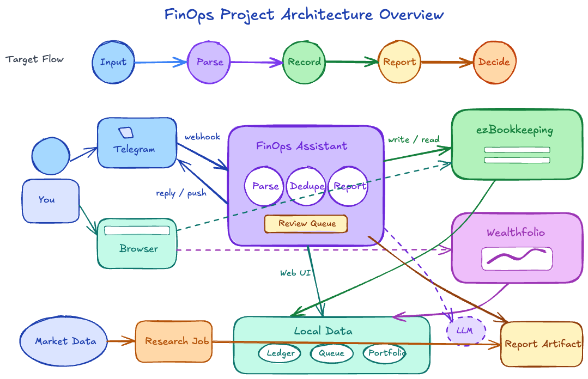

# homelab

Production-grade GitOps homelab on k3s — primary focus: a personal FinOps workspace deployed and operated via ArgoCD.

[](https://kubernetes.io)
[](https://k3s.io)
[](https://argoproj.github.io/cd)
[](https://helm.sh)
[](https://www.typescriptlang.org)
[](https://www.python.org)
[](https://github.com/features/actions)
[](https://grafana.com)

## Platform Overview

Single VPS node: Ubuntu 24.04, 4 CPU, 8 GB RAM, k3s v1.32.3+k3s1.

| Namespace | Key Workloads |
| --- | --- |
| `finops` | ezBookkeeping, FinOps Assistant, Wealthfolio, Market Research CronJob, Daily/EOD Report CronJobs |
| `observability` | Grafana, Loki, Prometheus, Tempo, OpenTelemetry Collector |
| `argocd` | ArgoCD controller, repo server, server, Redis, Dex, ApplicationSet controller |
| `furfriend-finder` | Application deployment, PostgreSQL StatefulSet, schema job, backup CronJob |
| `kube-system` | Traefik, CoreDNS, metrics-server, local-path provisioner, k3s service load balancer |
| `default` | NATS, node-exporter, cAdvisor, fluent-bit, vector aggregator |

## FinOps Workspace

A personal finance platform: expense bookkeeping via Telegram, portfolio tracking, and scheduled market research — all on a single VPS with a combined memory budget under 1 GiB.



| Service | Role | Storage |
| --- | --- | --- |
| ezBookkeeping | Bookkeeping source of truth — expenses, income, transfers, spending charts, PWA | 2 Gi PVC (SQLite) |
| FinOps Assistant | Custom TypeScript service — Telegram webhook/polling, idempotency, pending review queue, ezBookkeeping API integration, report orchestration | 512 Mi PVC (SQLite) |
| Wealthfolio | Portfolio UI — holdings, performance, net worth, investment charts | 2 Gi PVC (SQLite) |
| Market Research CronJob | Python/OpenBB — TWSE + NASDAQ watchlist commentary, runs 15 min before market open | Writes to assistant report storage |
| Daily/EOD Report CronJobs | curl-based — triggers assistant report endpoints on schedule | — |

All finance UIs and assistant endpoints sit behind a `privateAccess` Traefik middleware. No finance credentials are stored in the repo; all secrets are injected via `finops-secrets` Kubernetes Secret.

## GitOps and CI/CD

GitHub Actions builds Docker images on changes to `apps/finops-assistant/**` or `jobs/market-research/**` and pushes them to GHCR (`ghcr.io/ctchen222/finops-assistant`, `ghcr.io/ctchen222/finops-market-research`). ArgoCD watches the same repo on `main` and auto-syncs with prune and ServerSideApply enabled — the GitOps loop is fully closed.


## Observability

| Tool | Role |
| --- | --- |
| Prometheus | Metrics collection and alerting rules |
| Loki | Log aggregation |
| Tempo | Distributed tracing |
| Grafana | Dashboards for all three signal types |
| OpenTelemetry Collector | Unified ingestion layer for metrics, logs, and traces |

## Resource Budget

All always-on FinOps services combined stay under 1 GiB RAM and 1 CPU on a 4-CPU 8 GB node.

| Component | CPU Request | CPU Limit | Memory Request | Memory Limit | Storage |
| --- | ---: | ---: | ---: | ---: | --- |
| ezBookkeeping | 50m | 250m | 128Mi | 256Mi | 2 Gi PVC |
| FinOps Assistant | 25m | 100m | 64Mi | 128Mi | 512 Mi PVC |
| Wealthfolio | 100m | 500m | 256Mi | 512Mi | 2 Gi PVC |
| Market Research CronJob | 100m | 500m | 128Mi | 512Mi | shared report storage |

Total always-on: <1 GiB RAM / <1 CPU on a 4-CPU 8 GB node.

Node baseline (captured 2026-05-22): 126m CPU (~3%), 4252Mi memory (~63%), 28 Gi total PVC claimed.

## Design Decisions

- **SQLite over PostgreSQL**: Adding PostgreSQL would consume ~512 Mi additional RAM on an already-constrained node. ezBookkeeping, Wealthfolio, and the assistant all use SQLite on PVCs. Migration to PostgreSQL is straightforward if concurrency, backup, or reporting requirements grow.
- **Private access boundary**: All finance UIs and assistant endpoints are wrapped by a Traefik `privateAccess` middleware before exposure. Secrets (Telegram token, ezBookkeeping API token, basic auth credentials) are injected exclusively via Kubernetes Secret — no tokens are present in the repository.

## Repo Structure

```
apps/finops-assistant/     # TypeScript service (Dockerfile, src/, test/)
charts/finops-workspace/   # Helm chart (templates/, values-prod-stage*.yaml)
config/finops/             # Bootstrap configs
deploy/argocd/             # ArgoCD Application manifest
deploy/traefik/            # HelmChartConfig for Traefik
docs/finops/               # Runbook, stack decisions, portfolio contracts
jobs/market-research/      # Python CronJob (Dockerfile, market_research.py)
openspec/                  # Change management specs
.github/workflows/         # CI: publish-finops-images.yml
```

## Roadmap

- **Portfolio sync** — read-only SinoPac/Firstrade connectors producing normalized portfolio snapshots; Wealthfolio export integration (`openspec/changes/investment-portfolio-sync`)
- **Investment research reports** — Taiwan/US market data ingestion, deterministic signals, LLM-assisted report prose, Telegram delivery (`openspec/changes/add-investment-research-reports`)
- **Homelab homepage** — unified service catalog with status and links for all namespaces (`openspec/changes/add-homelab-homepage`)
- **External Secrets Operator** — replace manually created Kubernetes Secrets with ESO pulling from a vault; eliminates the manual bootstrap step for each new secret
